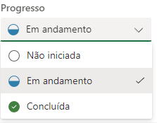

# Anotações do Fluxo de volta de dados do planner para o Project

<!-- Contexto em si -->

## Formulas/Lógica

1 -  se não houve nenhum avanço na tarefa = Início previsto/Término previsto precisa ser reagendado

2 - se houve avanço na tarefa porém não foi concluída = início real/ Término previsto

3 - se a tarefa for finalizada = Início real/ Término real

<!-- como o planner funciona -->

## condições planner

### O planner tem um sistema que temos o progresso como métrica 

1 - progresso Não iníciado = 0%

2 - progresso Em andamento = 50%

3 - progresso Conclúido = 100%

<!-- Observações -->

### O Fluxo precisa ser escrito sempre do término para o início

## Colunas Project

1 - "Finish" escreve na término previsto

2 - "ActualFinish" escreve na término real

lembrando que se caso houver uma tarefa com término real e for reescrever o término previsto teremos um problema porque ele vai ser reagendado

obs²: Não pode haver uma tarefa com um término anterior ao início do projeto (O project não aceita o reagendamento de início do projeto neste caso)

